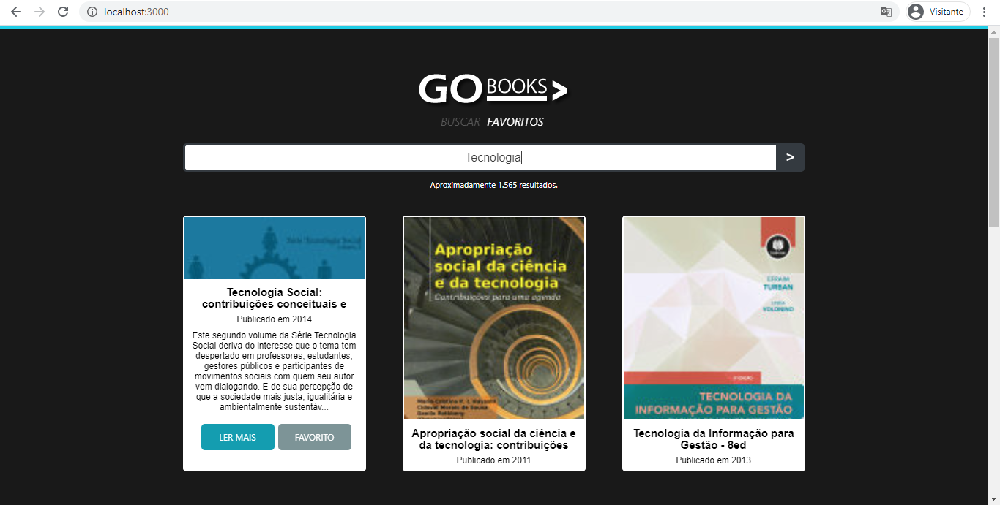

<h1 align="center">
    
</h1>
o
<h4 align="center"> 
	🚧 Desafio Dev. 🚀 🚧
</h4>

<p align="center">
  
  

</p>

## 💻 Sobre o projeto

♻️ GoBooks

É um desafio almejando uma vaga no programa de Devs da Riachuelo.

[ACESSE AQUI!](http://gobooks.surge.sh/)

Detalhes:
</br>
● Criar um sistema para buscar livros disponíveis na API do Google Books
</br>
● O layout da aplicação fica a cargo do desenvolvedor
</br>
● Em todos os resultados das buscas devem retornar os itens descritos abaixo:
</br>

- Imagem da capa do livro
- Título
- descrição
- data de publicação
  </br></br>
  Requisitos funcionais

● Como usuário gostaria de digitar algumas palavras e ver uma lista de livros que tenham relação com a minha busca.
</br>
● Como usuário gostaria de clicar em um destes livros para ver em detalhes as descrições do livro
</br>
● Como usuário gostaria de marcar o livro como favorito para, futuramente filtrá-los por isso
</br>
● Como usuário eu devo utilizar um paginador para acessar o restante dos resultados
</br>
● Como usuário eu gostaria de abrir o site em um dispositivo móvel sem comprometer a navegação do site.
</br>
</br>
Requisitos não funcionais

● Você pode utilizar qualquer framework JavaScript que quiser (Indicamos: React)
</br>
● Tente reutilizar o máximo possível de código
</br>
● Realize commits (git) constantes de acordo com a progressão das atividades.
</br>
Links relacionados
</br>
● API Google Books - https://developers.google.com/books/
</br>
</br>
Entrega
</br>
● Entrega deve ser feito em um repositório Git, pode ser no github ou no Bitbucket
</br>

## 🚀 Como executar o projeto

### Pré-requisitos

Antes de começar, você vai precisar ter instalado em sua máquina as seguintes ferramentas:
[Git](https://git-scm.com), [Node.js][nodejs].
Além disto é bom ter um editor para trabalhar com o código como [VSCode][vscode]

### 🧭 Rodando a aplicação web (Front End)

```bash
# Clone este repositório
$ git clone https://github.com/osmarsoujirou/gobooks

# Acesse a pasta do projeto no seu terminal/cmd
$ cd gobooks

# Instale as dependências
$ npm install

# Execute a aplicação em modo de desenvolvimento
$ npm run start

# A aplicação será aberta na porta:3000 - acesse http://localhost:3000

```

## 📝

Feito com ❤️ por Osmar Araujo 👋🏽 [Entre em contato!](https://www.linkedin.com/in/osmar-borges-98793515a/)
